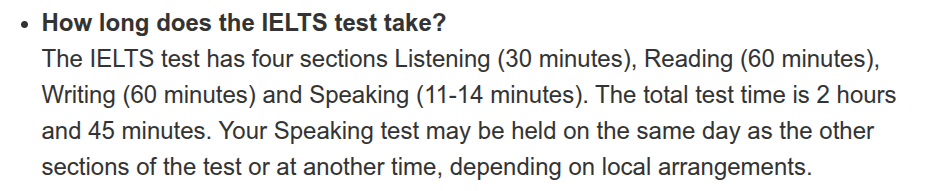

#  每天需要做的事情

1. 完成一份练习（挨着顺序做，写和说放在一起，口语写出来，要求最后一篇要在150-200字左右。其余部分一份一份做恰好时间）

   时间请参考：

   

2. 整理单词，具体要求见本文件夹后续。
3. 听力需要重复一句一句听，用纸抄写下来，用小站雅思，不要买课，他本身是免费的
4. 每天用**衡水体**抄写一篇作文。
5. 手写打卡请转制成pdf后上传至个人文件夹

案例请见EXAMPLE文件夹